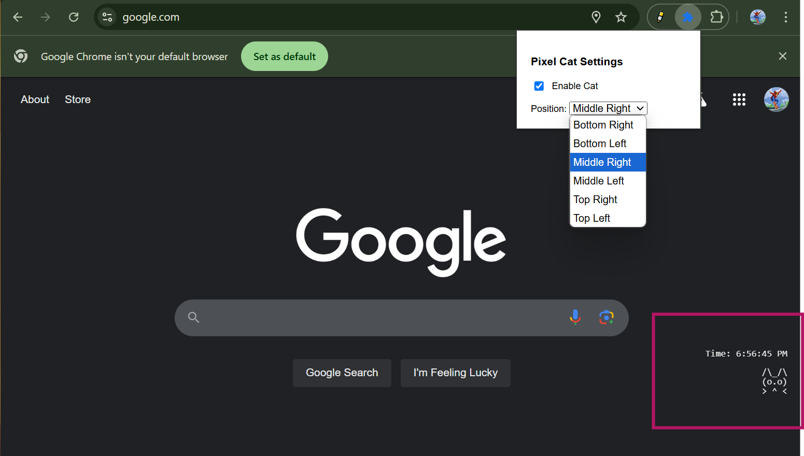

#  Pixel Cat Companion 

A friendly ASCII cat companion for Chrome that displays system information.

## Features

- 🐱 Cute ASCII cat that lives in your browser
- 📊 Displays system information (IP, time, screen resolution, etc.)
- 🎯 Customizable position (6 different locations)
- 🔄 Reacts to browsing activity (scrolling, idle state)
- 💾 Remembers position across browser sessions

## Information Displayed

- IP Address
- Current Time
- Screen Resolution
- Platform/OS
- Language
- Battery Level
- Network Status
- Memory Usage
- Device Type

## Installation

1. Clone this repository
2. Open Chrome and navigate to `chrome://extensions/`
3. Enable "Developer mode"
4. Click "Load unpacked" and select the extension directory

## Usage

- Click the cat to cycle through different system information
- Use the extension popup to:
  - Enable/disable the cat
  - Change the cat's position
- The cat will:
  - Think when you scroll
  - Sleep when idle
  - Wave when clicked

## License

MIT License 